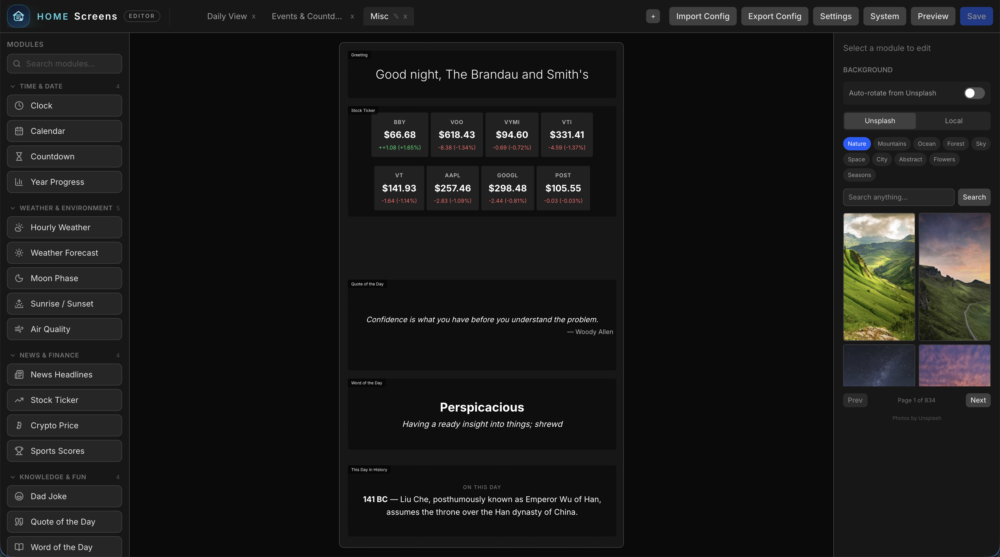
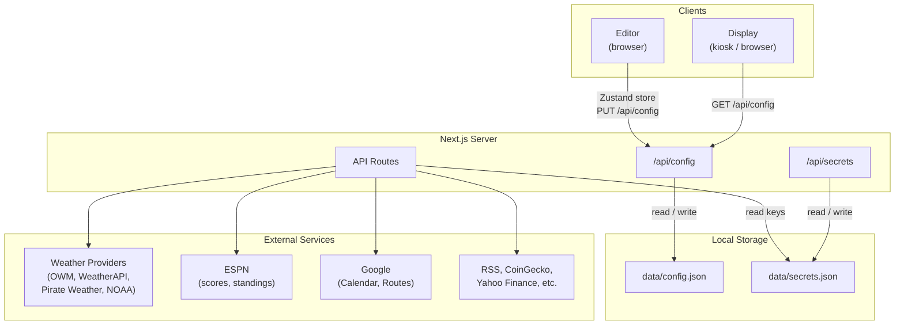
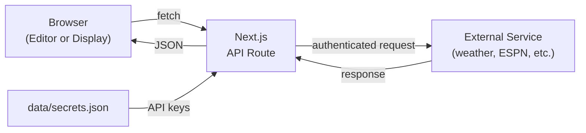
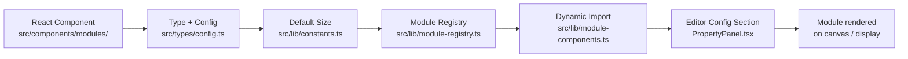

<p align="center">
  
</p>

# Home Screens

A custom smart display system built with Next.js. Designed to run on a Raspberry Pi in Chromium kiosk mode, replacing Dakboard/MagicMirror with a fully web-based, drag-and-drop configurable display.

## Screenshots




## Features

- **Drag-and-drop editor** — visually arrange modules on a 1080x1920 portrait canvas
- **Multi-screen rotation** — configure multiple screens that cycle automatically
- **30 built-in modules** — clock, calendar, weather (8 views), countdown, dad jokes, text, image, quote, todo, sticky note, greeting, news, stock ticker, crypto, word of the day, this day in history, moon phase, sunrise/sunset, photo slideshow, QR code, year progress, traffic/commute, sports scores, air quality, todoist, rain map, multi-month calendar, garbage day, sports standings, and affirmations
- **4 weather providers** — OpenWeatherMap, WeatherAPI, Pirate Weather, and NOAA (free, no API key) with a shared interface
- **Profile system** — define screen groups with schedule-based auto-activation (day of week, time windows)
- **Remote display control** — wake, sleep, brightness, screen navigation, and alerts via simple HTTP endpoints
- **Per-module scheduling** — show or hide individual modules by day of week and time window
- **Google Calendar integration** — display upcoming events from one or more calendars
- **Background images** — upload custom backgrounds or rotate via Unsplash
- **Per-module styling** — opacity, blur, colors, fonts, border radius, padding
- **Password-protected editor** — optional password auth for the configuration editor
- **System management** — upgrade, rollback, backup/restore, and power control from the UI
- **Raspberry Pi kiosk scripts** — one-command setup for a dedicated display
- **Configurable screen transitions** — 8 effects (fade, slide, slide-up, zoom, flip, blur, crossfade, none) with adjustable duration
- **Auto-hide cursor** — cursor hides after a configurable idle period on the display
- **Pre-release update channel** — opt into the dev channel for early updates

## Architecture Overview



## Tech Stack

- Next.js 16 / React 19 (App Router)
- Tailwind CSS v4
- @dnd-kit (drag-and-drop)
- Zustand (editor state)
- Framer Motion (screen transitions)
- Vitest (testing)

## Getting Started

```bash
# Install dependencies
npm install

# Run development server
npm run dev
```

Then visit:
- `http://localhost:3000/editor` — configure your screens
- `http://localhost:3000/display` — fullscreen display view

## Environment Variables

All API keys and credentials are configured through the editor UI under **Settings → Integrations**. No `.env.local` file is required for normal use.

## Google Calendar Setup

Google Calendar uses the **OAuth 2.0 Device Flow**, which means you can authorize from any device on your network — no redirect URI or public domain required. This is ideal for a kiosk display.

1. Go to [Google Cloud Console](https://console.cloud.google.com) → **APIs & Services → Credentials**
2. Click **Create Credentials → OAuth Client ID**
3. Application type: **TVs and Limited Input devices**
4. Name it anything (e.g. "Home Screen Display")
5. In the editor, go to **Settings → Integrations** and enter the **Client ID** and **Client Secret**
6. Enable the **Google Calendar API** at APIs & Services → Library → search "Google Calendar API" → Enable
7. In the editor, go to Settings → Google Calendar → **Sign in with Google**
8. You'll see a code and a link to `google.com/device` — open that link on your phone or computer, enter the code, and grant access

## Raspberry Pi Install

Clone the repo and run the install script on a fresh Raspberry Pi OS:

```bash
git clone https://github.com/agent462/home-screens.git
~/home-screens/scripts/install.sh
```

The script handles everything:
- Downloads the latest pre-built release to `/opt/home-screens/`
- Installs Node.js 22, Chromium, and system dependencies
- Creates the systemd service and configures the kiosk
- Configures autologin and display orientation

After install, reboot to start the kiosk:

```bash
sudo reboot
```

### Manual Start

To run without the systemd services:

```bash
bash scripts/start-display.sh
```

### Managing the Services

```bash
sudo systemctl start home-screens     # start the server
sudo systemctl stop home-screens      # stop server + kiosk
sudo systemctl status home-screens    # check status
journalctl -u home-screens -f         # view logs
```

## Project Structure

```
src/
  app/
    (display)/display/   # Fullscreen kiosk view
    (editor)/editor/     # Configuration editor
    api/                 # Config, calendar, weather, jokes, backgrounds, and more
  components/
    modules/             # Clock, Calendar, Weather, Countdown, Quote, News, etc.
    display/             # Screen rotator, screen renderer
    editor/              # Canvas, module palette, property panel, settings, backgrounds
  lib/                   # Config I/O, weather providers, Google Calendar
  stores/                # Zustand editor store
  types/                 # TypeScript config types
data/
  config.json            # Screen configuration (file-based, no database)
scripts/
  install.sh             # Full Raspberry Pi install script
  start-display.sh       # Manual start script
```

## API Routes

All API routes are server-side proxies that keep credentials off the client. The request flow:



| Route | Methods | Description |
|---|---|---|
| `/api/config` | GET, PUT | Read/write screen configuration |
| `/api/calendar` | GET | Google Calendar event proxy |
| `/api/calendars` | GET | List available Google Calendars |
| `/api/weather` | GET | Weather data (4 providers) |
| `/api/geocode` | GET | Location geocoding for weather |
| `/api/jokes` | GET | Dad jokes proxy |
| `/api/quote` | GET | ZenQuotes daily quote proxy |
| `/api/news` | GET | RSS feed parser |
| `/api/stocks` | GET | Yahoo Finance stock prices |
| `/api/crypto` | GET | CoinGecko crypto prices |
| `/api/history` | GET | This day in history |
| `/api/backgrounds` | GET, POST | List/upload background images |
| `/api/unsplash` | GET | Unsplash background photos |
| `/api/traffic` | GET | Traffic/commute times (Google Routes or TomTom) |
| `/api/sports` | GET | Live sports scores (ESPN) |
| `/api/air-quality` | GET | Air quality index and UV (OpenWeatherMap) |
| `/api/todoist` | GET | Todoist tasks proxy |
| `/api/rain-map` | GET | RainViewer precipitation map tiles |
| `/api/standings` | GET | ESPN league standings |
| `/api/time` | GET | Server time |
| `/api/image-proxy` | GET | Proxy external images |
| `/api/secrets` | GET, PUT | Manage API keys and credentials |
| `/api/display/*` | GET, POST | Remote display control (wake, sleep, brightness, navigation, alerts) |
| `/api/auth/*` | GET, POST | Authentication (password + Google OAuth) |
| `/api/system/*` | GET, POST | System management (version, upgrade, rollback, backups, power) |

## Documentation

- [Getting Started](docs/getting-started.md) — installation and setup
- [Editor Guide](docs/editor.md) — how to use the visual editor
- [Modules Reference](docs/modules.md) — all 30 modules and their options
- [API Reference](docs/api.md) — all API endpoints
- [Configuration](docs/configuration.md) — config file schema and examples
- [Raspberry Pi Deployment](docs/raspberry-pi.md) — kiosk setup and troubleshooting
- [Development Guide](docs/development.md) — architecture, adding modules, and contributing

## Adding a Module

1. Create a component in `src/components/modules/`
2. Add the type to `ModuleType` in `src/types/config.ts`
3. Define its config interface in `src/types/config.ts`
4. Add a default size in `src/lib/constants.ts`
5. Register it in `src/lib/module-registry.ts`
6. Add a dynamic import in `src/lib/module-components.ts`
7. Add an editor config section in `src/components/editor/PropertyPanel.tsx`
8. (Optional) Create an API route in `src/app/api/` if external data is needed

### Module Registration Flow



See the [Development Guide](docs/development.md) for a detailed walkthrough.
