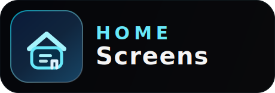
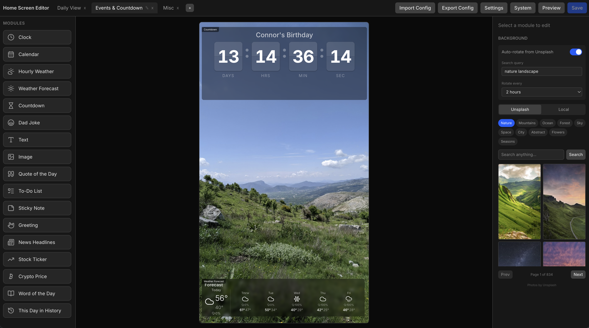
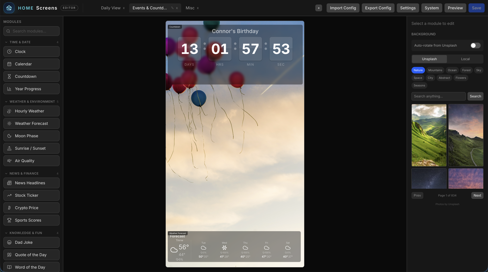

<p align="center">
  
</p>

# Home Screens

A custom smart display system built with Next.js. Designed to run on a Raspberry Pi in Chromium kiosk mode, replacing Dakboard/MagicMirror with a fully web-based, drag-and-drop configurable display.

## Screenshots





## Features

- **Drag-and-drop editor** — visually arrange modules on a 1080x1920 portrait canvas
- **Multi-screen rotation** — configure multiple screens that cycle automatically
- **25 built-in modules** — clock, calendar, weather (hourly + forecast), countdown, dad jokes, text, image, quote, todo, sticky note, greeting, news, stock ticker, crypto, word of the day, this day in history, moon phase, sunrise/sunset, photo slideshow, QR code, year progress, traffic/commute, sports scores, and air quality
- **Dual weather providers** — OpenWeatherMap and WeatherAPI with a shared interface
- **Google Calendar integration** — display upcoming events from one or more calendars
- **Background images** — upload custom backgrounds or rotate via Unsplash
- **Per-module styling** — opacity, blur, colors, fonts, border radius, padding
- **Raspberry Pi kiosk scripts** — one-command setup for a dedicated display

## Tech Stack

- Next.js 16 / React 19 (App Router)
- Tailwind CSS v4
- @dnd-kit (drag-and-drop)
- Zustand (editor state)
- Framer Motion (screen transitions)
- Zod (config validation)

## Getting Started

```bash
# Install dependencies
npm install

# Copy environment variables
cp .env.local.example .env.local
# Edit .env.local with your API keys

# Run development server
npm run dev
```

Then visit:
- `http://localhost:3000/editor` — configure your screens
- `http://localhost:3000/display` — fullscreen display view

## Environment Variables

| Variable | Description | Required |
|---|---|---|
| `GOOGLE_CLIENT_ID` | Google OAuth client ID (for calendar) | For calendar |
| `GOOGLE_CLIENT_SECRET` | Google OAuth client secret | For calendar |
| `OPENWEATHERMAP_API_KEY` | OpenWeatherMap API key (fallback if not set in editor) | Optional |
| `WEATHERAPI_KEY` | WeatherAPI.com API key (fallback if not set in editor) | Optional |
| `GOOGLE_MAPS_API_KEY` | Google Routes API key (for traffic module) | For traffic |
| `TOMTOM_API_KEY` | TomTom Routing API key (traffic fallback) | For traffic |

Weather API keys can be configured either in `.env.local` or through the editor UI (Settings > Weather). The editor config takes priority.

## Google Calendar Setup

Google Calendar uses the **OAuth 2.0 Device Flow**, which means you can authorize from any device on your network — no redirect URI or public domain required. This is ideal for a kiosk display.

1. Go to [Google Cloud Console](https://console.cloud.google.com) → **APIs & Services → Credentials**
2. Click **Create Credentials → OAuth Client ID**
3. Application type: **TVs and Limited Input devices**
4. Name it anything (e.g. "Home Screen Display")
5. Copy the **Client ID** and **Client Secret** into your `.env.local`
6. Enable the **Google Calendar API** at APIs & Services → Library → search "Google Calendar API" → Enable
7. In the editor, go to Settings → Google Calendar → **Sign in with Google**
8. You'll see a code and a link to `google.com/device` — open that link on your phone or computer, enter the code, and grant access

## Raspberry Pi Install

Run the install script on a fresh Raspberry Pi OS:

```bash
git clone <repo-url> ~/home-screens
cd ~/home-screens
bash scripts/install.sh
```

The script handles everything:
- Installs Node.js 20, Chromium, and system dependencies
- Prompts for API keys and writes `.env.local`
- Installs npm packages and builds the app
- Creates systemd services (`home-screens`, `home-screens-kiosk`)
- Disables screen blanking and configures autologin

After install, reboot to start the kiosk:

```bash
sudo reboot
```

### Manual Start

To run without the systemd services:

```bash
bash scripts/start-display.sh
```

### Managing the Services

```bash
sudo systemctl start home-screens     # start the server
sudo systemctl stop home-screens      # stop server + kiosk
sudo systemctl status home-screens    # check status
journalctl -u home-screens -f         # view logs
```

## Project Structure

```
src/
  app/
    (display)/display/   # Fullscreen kiosk view
    (editor)/editor/     # Configuration editor
    api/                 # Config, calendar, weather, jokes, backgrounds, and more
  components/
    modules/             # Clock, Calendar, Weather, Countdown, Quote, News, etc.
    display/             # Screen rotator, screen renderer
    editor/              # Canvas, module palette, property panel, settings, backgrounds
  lib/                   # Config I/O, weather providers, Google Calendar
  stores/                # Zustand editor store
  types/                 # TypeScript config types
data/
  config.json            # Screen configuration (file-based, no database)
scripts/
  install.sh             # Full Raspberry Pi install script
  setup-kiosk.sh         # Kiosk-only setup (used by install.sh)
  start-display.sh       # Manual start script
```

## API Routes

| Route | Methods | Description |
|---|---|---|
| `/api/config` | GET, PUT | Read/write screen configuration |
| `/api/calendar` | GET | Google Calendar event proxy |
| `/api/calendars` | GET | List available Google Calendars |
| `/api/weather` | GET | Weather data (dual provider) |
| `/api/geocode` | GET | Location geocoding for weather |
| `/api/jokes` | GET | Dad jokes proxy |
| `/api/quote` | GET | ZenQuotes daily quote proxy |
| `/api/news` | GET | RSS feed parser |
| `/api/stocks` | GET | Yahoo Finance stock prices |
| `/api/crypto` | GET | CoinGecko crypto prices |
| `/api/history` | GET | This day in history |
| `/api/backgrounds` | GET, POST | List/upload background images |
| `/api/unsplash` | GET | Unsplash background photos |
| `/api/traffic` | GET | Traffic/commute times (Google Routes or TomTom) |
| `/api/sports` | GET | Live sports scores (ESPN) |
| `/api/air-quality` | GET | Air quality index and UV (OpenWeatherMap) |

## Documentation

- [Getting Started](docs/getting-started.md) — installation and setup
- [Editor Guide](docs/editor.md) — how to use the visual editor
- [Modules Reference](docs/modules.md) — all 25 modules and their options
- [API Reference](docs/api.md) — all API endpoints
- [Configuration](docs/configuration.md) — config file schema and examples
- [Raspberry Pi Deployment](docs/raspberry-pi.md) — kiosk setup and troubleshooting
- [Development Guide](docs/development.md) — architecture, adding modules, and contributing

## Adding a Module

1. Create a component in `src/components/modules/`
2. Add the type to `ModuleType` in `src/types/config.ts`
3. Define its config interface in `src/types/config.ts`
4. Add a default size in `src/lib/constants.ts`
5. Register it in `src/lib/module-registry.ts`
6. Add a dynamic import in `src/lib/module-components.ts`
7. Add an editor config section in `src/components/editor/PropertyPanel.tsx`
8. (Optional) Create an API route in `src/app/api/` if external data is needed

See the [Development Guide](docs/development.md) for a detailed walkthrough.
