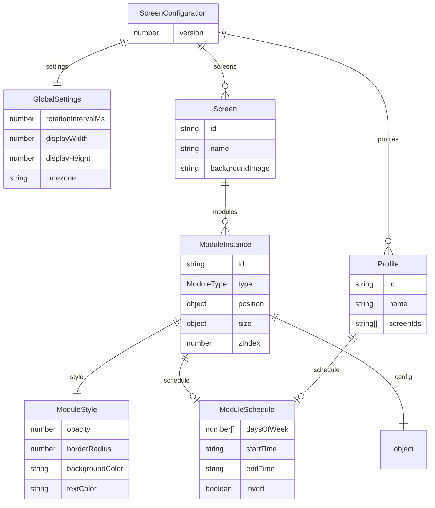

# Configuration

Home Screens uses a single JSON file for all configuration: `data/config.json`. There is no database — the file is read and written directly by the API.

## File Location

```
data/config.json
```

The config is read via `GET /api/config` and written via `PUT /api/config`. Writes are atomic (temp file + rename) to prevent corruption during power loss.

## API Keys & Credentials

API keys and credentials are managed through the editor UI under **Settings > Integrations** and stored server-side in `data/secrets.json` via the `/api/secrets` endpoint. They are **not** stored in `.env.local` or in the config file.

Supported secret keys:

| Key | Used By |
|---|---|
| `openweathermap_key` | Weather (OpenWeatherMap provider), Air Quality |
| `weatherapi_key` | Weather (WeatherAPI provider) |
| `pirateweather_key` | Weather (Pirate Weather provider) |
| `unsplash_access_key` | Background rotation (Unsplash) |
| `todoist_token` | Todoist module |
| `google_maps_key` | Traffic module (Google Routes) |
| `tomtom_key` | Traffic module (TomTom) |
| `google_client_id` | Google Calendar OAuth |
| `google_client_secret` | Google Calendar OAuth |

## Schema



### Top Level

```typescript
{
  version: number           // Config schema version (for migrations)
  settings: GlobalSettings  // System-wide settings
  screens: Screen[]         // Array of display screens
  profiles?: Profile[]      // Named screen groups with optional schedules
}
```

### GlobalSettings

```typescript
{
  rotationIntervalMs: number    // Screen rotation interval (default: 30000)
  displayWidth: number          // Canvas width in pixels (default: 1080)
  displayHeight: number         // Canvas height in pixels (default: 1920)
  displayTransform: string      // Screen rotation: "normal", "90", "180", "270"

  latitude: number              // Global location latitude
  longitude: number             // Global location longitude
  locationName: string          // Human-readable location name
  timezone: string              // IANA timezone (e.g. "America/Chicago")

  weather: {
    provider: string            // "openweathermap", "weatherapi", "pirateweather", "noaa", or "open-meteo"
    latitude: number            // Weather-specific latitude (overrides global)
    longitude: number           // Weather-specific longitude (overrides global)
    units: string               // "metric" or "imperial"
  }

  calendar: {
    googleCalendarId: string         // Primary calendar ID (legacy)
    googleCalendarIds: string[]      // Multiple calendar IDs
    maxEvents: number                // Max events to display
    daysAhead: number                // Days to look ahead
  }

  sleep: {
    enabled: boolean
    dimAfterMinutes: number     // Auto-dim after inactivity
    sleepAfterMinutes: number   // Auto-sleep after inactivity
    dimBrightness: number       // Dim level (0-100)
    dimSchedule: {              // Scheduled dimming
      startTime: string         // "HH:mm" format
      endTime: string           // "HH:mm" format
    }
    schedule: {                 // Scheduled sleep
      startTime: string         // "HH:mm" format
      endTime: string           // "HH:mm" format
    }
  }

  screensaver: {
    mode: string                // "clock", "blank", or "off"
  }

  activeProfile: string         // Currently active profile ID (optional)

  cursorHideSeconds?: number      // Seconds of idle before cursor hides (default: 3)
  transitionEffect?: TransitionEffect  // Screen transition effect
  transitionDuration?: number     // Transition duration in seconds (default: 0.6)
  updateChannel?: 'stable' | 'dev'    // Update channel for system upgrades
  piVariant?: 'desktop' | 'lite'      // Detected Raspberry Pi OS variant
}
```

### TransitionEffect

```typescript
type TransitionEffect =
  | 'fade' | 'slide' | 'slide-up' | 'zoom'
  | 'flip' | 'blur' | 'crossfade' | 'none';
```

### Screen

```typescript
{
  id: string                    // Unique ID (UUID)
  name: string                  // Display name (shown in editor tabs)
  backgroundImage: string       // Path to background image
  backgroundRotation: {         // Optional Unsplash background rotation
    enabled: boolean
    query: string
    intervalMinutes: number
  }
  modules: ModuleInstance[]     // Modules on this screen
}
```

### ModuleInstance

```typescript
{
  id: string                    // Unique ID (UUID)
  type: ModuleType              // Module type (e.g. "clock", "weather")
  position: { x: number, y: number }   // Top-left position in pixels
  size: { w: number, h: number }       // Width and height in pixels
  zIndex: number                        // Stacking order
  config: Record<string, unknown>       // Module-specific configuration
  style: ModuleStyle                    // Visual styling
  schedule?: ModuleSchedule             // Optional show/hide schedule
}
```

### ModuleSchedule

Controls when a module (or profile) is active based on day of week and time window.

```typescript
{
  daysOfWeek?: number[]    // 0=Sun, 1=Mon, ... 6=Sat (omit = every day)
  startTime?: string       // "06:00" (omit = from midnight)
  endTime?: string         // "09:00" (omit = until midnight)
  invert?: boolean         // if true, HIDE during this window instead of show
}
```

### Profile

Named groups of screens that can be activated manually or on a schedule.

```typescript
{
  id: string                    // Unique ID (UUID)
  name: string                  // Display name (e.g. "Morning", "Evening")
  screenIds: string[]           // Subset of screen IDs to show
  schedule?: ModuleSchedule     // Optional schedule for auto-activation
}
```

Profiles support overnight windows (e.g. 23:00–06:00). When multiple profiles have overlapping schedules, the first matching profile wins. Manual activation via `settings.activeProfile` overrides scheduled profiles.

### ModuleType

There are 30 module types:

```typescript
type ModuleType =
  | 'clock'
  | 'calendar'
  | 'weather'
  | 'countdown'
  | 'dad-joke'
  | 'text'
  | 'image'
  | 'quote'
  | 'todo'
  | 'sticky-note'
  | 'greeting'
  | 'news'
  | 'stock-ticker'
  | 'crypto'
  | 'word-of-day'
  | 'history'
  | 'moon-phase'
  | 'sunrise-sunset'
  | 'photo-slideshow'
  | 'qr-code'
  | 'year-progress'
  | 'traffic'
  | 'sports'
  | 'air-quality'
  | 'todoist'
  | 'rain-map'
  | 'multi-month'
  | 'garbage-day'
  | 'standings'
  | 'affirmations';
```

### ModuleStyle

```typescript
{
  opacity: number               // 0–1
  borderRadius: number          // Pixels
  padding: number               // Pixels
  backgroundColor: string      // CSS color (e.g. "rgba(0,0,0,0.4)")
  textColor: string             // CSS color (e.g. "#ffffff")
  fontFamily: string            // CSS font-family
  fontSize: number              // Base font size in pixels
  backdropBlur: number          // Backdrop blur in pixels
}
```

## Module Configs

### ClockConfig

```typescript
{
  format24h: boolean
  showSeconds: boolean
  showDate: boolean
  dateFormat: string
  showWeekNumber: boolean
  showDayOfYear: boolean
}
```

### CalendarConfig

```typescript
{
  viewMode: 'daily' | 'agenda' | 'week' | 'month'
  daysToShow: number
  showTime: boolean
  showLocation: boolean
  maxEvents: number
  showWeekNumbers: boolean
}
```

### WeatherConfig

Five providers are supported: **OpenWeatherMap**, **WeatherAPI**, **Pirate Weather** (a Dark Sky replacement with minutely precipitation and alerts), **NOAA** (free, no API key, US only), and **Open-Meteo** (free, no API key, global coverage). Eight views are available.

```typescript
{
  view: 'current' | 'hourly' | 'daily' | 'combined' | 'compact' | 'table' | 'precipitation' | 'alerts'
  iconSet: 'outline' | 'color'
  provider: 'global' | 'openweathermap' | 'weatherapi' | 'pirateweather' | 'noaa' | 'open-meteo'
  hoursToShow: number
  showFeelsLike: boolean
  daysToShow: number
  showHighLow: boolean
  showPrecipAmount: boolean
  showPrecipitation: boolean
  showHumidity: boolean
  showWind: boolean
}
```

### CountdownConfig

```typescript
{
  events: { id: string; name: string; date: string }[]
  showPastEvents: boolean
  scale: number               // 0.5 – 4, default 1
}
```

### DadJokeConfig

```typescript
{
  refreshIntervalMs: number
}
```

### TextConfig

```typescript
{
  content: string
  alignment: 'left' | 'center' | 'right'
  orientation?: 'horizontal' | 'vertical' | 'sideways'
  verticalAlign?: 'top' | 'center' | 'bottom'
  markdown?: boolean                    // Enable markdown rendering
  autoFit?: boolean                     // Auto-fit text to container
  effect?: 'none' | 'typewriter' | 'fade-in' | 'gradient-sweep' | 'glow'
  rotationEnabled?: boolean             // Rotate through content chunks
  rotationIntervalMs?: number           // Rotation interval
  rotationSeparator?: string            // Separator for splitting content
  gradientEnabled?: boolean             // Enable gradient text
  gradientFrom?: string                 // Gradient start color
  gradientTo?: string                   // Gradient end color
  gradientAngle?: number                // Gradient angle
  textTransform?: 'none' | 'uppercase' | 'lowercase' | 'capitalize'
  letterSpacing?: number                // Letter spacing in px
  icon?: string                         // Icon prefix (emoji)
  templateVariables?: boolean           // Enable {{time}}, {{date}}, etc.
  marquee?: boolean                     // Enable marquee scrolling
  marqueeSpeed?: number                 // Marquee scroll speed
  marqueeDirection?: 'left' | 'right' | 'up' | 'down'
}
```

### ImageConfig

```typescript
{
  src: string
  objectFit: 'cover' | 'contain' | 'fill'
  alt: string
}
```

### QuoteConfig

```typescript
{
  refreshIntervalMs: number
}
```

### TodoConfig

```typescript
{
  title: string
  items: { id: string; text: string; completed: boolean }[]
}
```

### StickyNoteConfig

```typescript
{
  content: string
  noteColor: string
}
```

### GreetingConfig

```typescript
{
  name: string
}
```

### NewsConfig

```typescript
{
  feedUrl: string
  view: 'headline' | 'list' | 'ticker' | 'compact'
  refreshIntervalMs: number
  rotateIntervalMs: number
  maxItems: number
  showTimestamp: boolean
  showDescription: boolean
  tickerSpeed: number
}
```

### StockTickerConfig

```typescript
{
  symbols: string
  refreshIntervalMs: number
  view: 'cards' | 'ticker' | 'table' | 'compact'
  cardScale: number
  tickerSpeed: number
}
```

### CryptoConfig

```typescript
{
  ids: string
  refreshIntervalMs: number
  view: 'cards' | 'ticker' | 'table' | 'compact'
  cardScale: number
  tickerSpeed: number
}
```

### WordOfDayConfig

```typescript
{
  refreshIntervalMs: number
}
```

### HistoryConfig

```typescript
{
  refreshIntervalMs: number
  rotationIntervalMs: number
}
```

### MoonPhaseConfig

```typescript
{
  showIllumination: boolean
  showMoonTimes: boolean
}
```

### SunriseSunsetConfig

```typescript
{
  showDayLength: boolean
  showGoldenHour: boolean
}
```

### PhotoSlideshowConfig

```typescript
{
  directory: string
  intervalMs: number
  transition: 'fade' | 'none'
  objectFit: 'cover' | 'contain' | 'fill'
  refreshIntervalMs: number
}
```

### QRCodeConfig

```typescript
{
  mode: 'custom' | 'wifi'
  // Custom mode
  data: string
  label: string
  // WiFi mode
  ssid: string
  password: string
  authType: 'WPA' | 'WEP' | 'nopass'
  hiddenNetwork: boolean
  showPassword: boolean
  showNetworkName: boolean
  // Shared
  fgColor: string
  bgColor: string
}
```

### YearProgressConfig

```typescript
{
  showYear: boolean
  showMonth: boolean
  showWeek: boolean
  showDay: boolean
  showPercentage: boolean
}
```

### TrafficConfig

```typescript
{
  routes: { label: string; origin: string; destination: string }[]
  refreshIntervalMs: number
}
```

### SportsConfig

```typescript
{
  view: 'scoreboard' | 'cards' | 'list' | 'ticker'
  leagues: string[]
  refreshIntervalMs: number
  tickerSpeed: number
}
```

### AirQualityConfig

```typescript
{
  showAQI: boolean
  showPollutants: boolean
  showUV: boolean
  refreshIntervalMs: number
}
```

### TodoistConfig

Connects to the Todoist API (requires a Todoist API token configured in Settings > Integrations).

```typescript
{
  viewMode: 'list' | 'board' | 'focus'
  groupBy: 'none' | 'project' | 'priority' | 'date' | 'label'
  sortBy: 'default' | 'priority' | 'due_date' | 'alphabetical'
  projectFilter: string
  labelFilter: string
  showNoDueDate: boolean
  showSubtasks: boolean
  showLabels: boolean
  showProject: boolean
  showDescription: boolean
  maxTasks: number
  refreshIntervalMs: number
  title: string
}
```

### RainMapConfig

Animated precipitation radar overlay on a map tile layer. Uses RainViewer API.

```typescript
{
  latitude: number
  longitude: number
  zoom: number
  animationSpeedMs: number
  extraDelayLastFrameMs: number
  colorScheme: number
  smooth: boolean
  showSnow: boolean
  opacity: number
  showTimestamp: boolean
  showTimeline: boolean
  refreshIntervalMs: number
  mapStyle: 'dark' | 'standard'
}
```

### MultiMonthConfig

Displays multiple months in a calendar grid.

```typescript
{
  view: 'vertical' | 'horizontal'
  monthCount: number
  startDay: 'sunday' | 'monday'
  showWeekNumbers: boolean
  highlightWeekends: boolean
  showAdjacentDays: boolean
}
```

### GarbageDayConfig

Tracks collection schedules for trash, recycling, and a custom bin. Supports weekly or biweekly frequencies.

```typescript
{
  trashDay: number            // 0=Sun, 1=Mon, ..., 6=Sat, -1=disabled
  trashFrequency: 'weekly' | 'biweekly'
  trashStartDate: string      // ISO date anchor for biweekly calculation
  trashColor: string
  recyclingDay: number
  recyclingFrequency: 'weekly' | 'biweekly'
  recyclingStartDate: string
  recyclingColor: string
  customDay: number
  customFrequency: 'weekly' | 'biweekly'
  customStartDate: string
  customColor: string
  customLabel: string
  highlightMode: 'day-of' | 'day-before'
}
```

### AffirmationsConfig

Rotating positive affirmations with 4 visual styles and 5 categories. Supports time-aware selection.

```typescript
{
  view: 'elegant' | 'card' | 'minimal' | 'typewriter'
  categories: ('affirmations' | 'compliments' | 'motivational' | 'gratitude' | 'mindfulness')[]
  rotationIntervalMs: number
  showCategoryLabel: boolean
  timeAware: boolean           // Adjust messages based on time of day, day of week, season
  customEntries: { id: string; text: string; category?: string }[]
  accentColor: string          // Accent color for card/typewriter views
}
```

### StandingsConfig

Displays league standings from ESPN. Supports 12 leagues with team colors. Three views: full table, compact, and conference.

```typescript
{
  view: 'table' | 'compact' | 'conference'
  league: string
  grouping: 'division' | 'conference' | 'league'
  teamsToShow: number
  showPlayoffLine: boolean
  rotationIntervalMs: number
  refreshIntervalMs: number
}
```

## Display Resolution Presets

| Preset | Width | Height |
|---|---|---|
| Portrait 1080p | 1080 | 1920 |
| Portrait 1440p | 1440 | 2560 |
| Portrait 4K | 2160 | 3840 |
| Landscape 720p | 1280 | 720 |
| Landscape 1080p | 1920 | 1080 |
| Landscape 1440p | 2560 | 1440 |
| Landscape 4K | 3840 | 2160 |

## Config Migrations

Config files include a `version` number. When the schema changes between releases, migrations in `src/lib/migrations/` automatically transform older configs to the current format on load.

## Backup & Restore

- **Export** from the editor's System Panel downloads the config as JSON
- **Import** replaces the current config with an uploaded JSON file
- Manual backups: copy `data/config.json` to a safe location

## Example

```json
{
  "version": 1,
  "settings": {
    "rotationIntervalMs": 30000,
    "displayWidth": 1080,
    "displayHeight": 1920,
    "latitude": 44.7133,
    "longitude": -93.4227,
    "timezone": "America/Chicago",
    "weather": {
      "provider": "pirateweather",
      "latitude": 44.7133,
      "longitude": -93.4227,
      "units": "imperial"
    },
    "calendar": {
      "googleCalendarIds": ["primary"],
      "maxEvents": 10,
      "daysAhead": 7
    }
  },
  "screens": [
    {
      "id": "abc-123",
      "name": "Main",
      "backgroundImage": "/backgrounds/sunset.jpg",
      "modules": [
        {
          "id": "mod-1",
          "type": "clock",
          "position": { "x": 20, "y": 40 },
          "size": { "w": 1040, "h": 220 },
          "zIndex": 1,
          "config": {
            "format24h": false,
            "showSeconds": true,
            "showDate": true
          },
          "style": {
            "opacity": 1,
            "borderRadius": 12,
            "padding": 16,
            "backgroundColor": "rgba(0,0,0,0.4)",
            "textColor": "#ffffff",
            "fontFamily": "Inter, system-ui, sans-serif",
            "fontSize": 16,
            "backdropBlur": 12
          }
        }
      ]
    }
  ]
}
```
